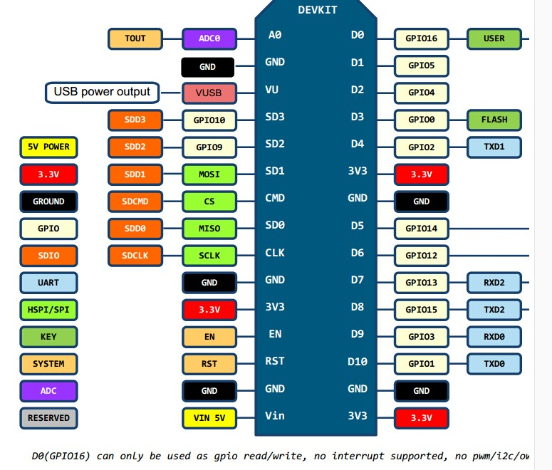
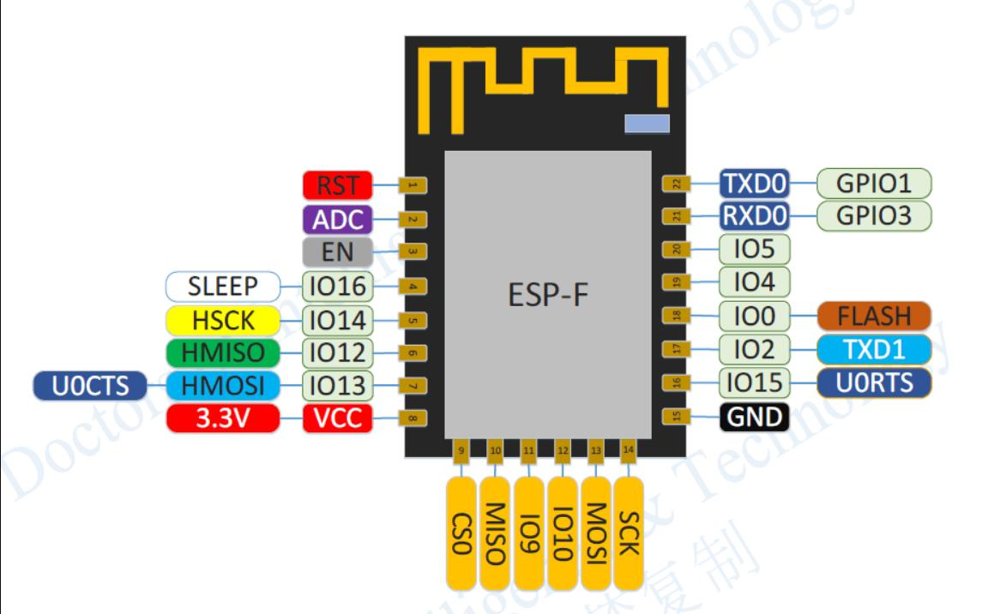

# ESP8266 Interface Description

| Gpio | Name/Fun0 | Fun1      | Fun2       | Fun3      | Fun4       |
| ---- | --------- | --------- | ---------- | --------- | ---------- |
| 0    | GPIO0     | SPI_CS2   | -          | -         | CLK_OUT    |
| 1    | U0TXD     | SPI_CS1   | -          | GPIO1     | CLK_RTC    |
| 2    | GPIO2     | I2SO_WS   | U1TXD      | -         | U0TXD      |
| 3    | U0RXD     | I2SO_DATA | -          | GPIO3     | CLK_XTAL   |
| 4    | GPIO4     | CLK_XTAL  | -          | -         | -          |
| 5    | GPIO5     | CLK_RTC   | -          | -         | -          |
| #6   | SD_CLK    | SPI_CLK   | -          | GPIO6     | U1CTS      |
| #7   | SD_DATA0  | SPI_Q     | -          | GPIO7     | U1TXD      |
| #8   | SD_DATA1  | SPI_D     | -          | GPIO8     | U1RXD      |
| #9   | SD_DATA2  | SPI_HD    | -          | GPIO9     | HSPIHD     |
| #10  | SD_DATA3  | SPI_WP    | -          | GPIO10    | HSPIWP     |
| #11  | SD_CMD    | SPI_CS0   | -          | GPIO11    | U1RTS      |
| 12   | MTDI      | I2SI_DATA | HSPI_IQ    | GPIO12    | U0DTR      |
| 13   | MTCK      | I2SI_BCK  | HSPI_ID    | GPIO13    | U0CTS      |
| 14   | MTMS      | I2SI_WS   | HSPI_CLK   | GPIO14    | U0DSR      |
| 15   | MTDO      | I2SO_BCK  | HSPI_CS    | GPIO15    | U0RTS      |
| #16  | XPD_DCDC  | RTC_GPIO0 | EXT_WAKEUP | DEEPSLEEP | BT_XTAL_EN |

